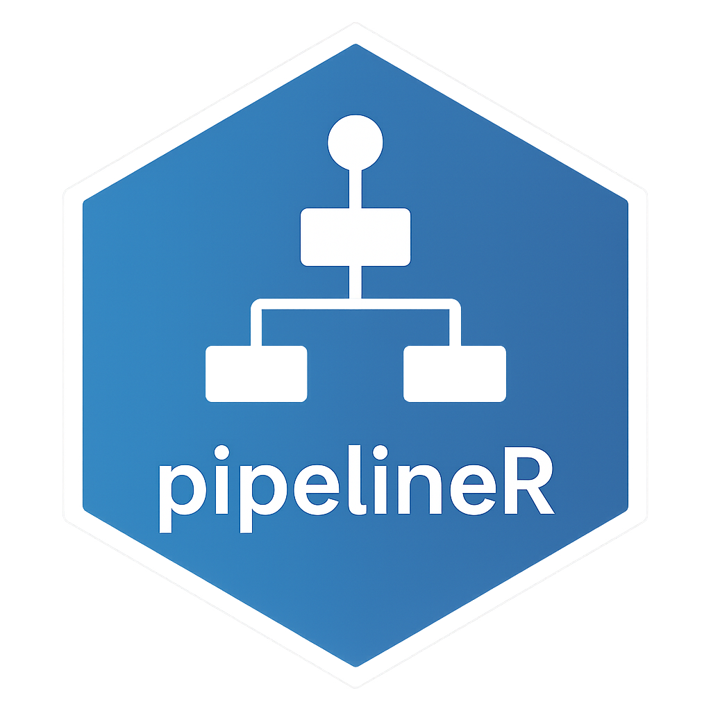

# 

Welcome to the **pipelineR** package! 🚀

**pipelineR** is a lightweight internal R package designed to automate the fetching, cleaning, and inserting of stock market data into a PostgreSQL database.


---

## Features

- Connect securely to a PostgreSQL database
- Fetch historical OHLCV stock data from Yahoo Finance
- Automatically clean and reshape the data
- Insert only new (non-duplicate) rows into the database
- Log processing batches into a pipeline_logs table
- Fully tested with `testthat`

---

## Installation

```r
# You can install directly from the internal Git repository:
remotes::install_github("pkinif/pipelineR")

```

---

## Usage

Connect to the database:

```r
library(pipelineR)
con <- connect_db()
```

Make sure your `.Renviron` contains:

    PG_DB='yourdbname'
    PG_HOST='yourhost'
    PG_USER='youruser'
    PG_PASSWORD='yourpassword'
    PG_SCHEMA='yourschema'
    user_login='yourname'
    
Run the full pipeline:

```r
pipelineR::start_pipeline(
  from = Sys.Date() - 10,
  to = Sys.Date(),
  batch_size = 20
)
```

---

## Main Functions

| Function | Description |
|:---------|:------------|
| `connect_db()` | Connect to the PostgreSQL database |
| `fetch_symbols()` | Fetch the list of stock symbols to process |
| `split_batch()` | Split the list into smaller batches |
| `yahoo_query_data()` | Download stock data from Yahoo Finance |
| `insert_new_data()` | Insert cleaned data into the database |
| `build_summary_table()` | Create a summary table to track batch processing |
| `log_summary()` | Log a batch into the summary table |
| `push_summary_table()` | Push summary logs into the database |
| `start_pipeline()` | Orchestrate the entire ETL process |

---

## Tests

All major functions are covered by `testthat` unit tests.  
Tests are automatically executed in the CI/CD pipeline to ensure the package remains stable after each update.


---

##  Requirements

- R >= 4.1.0
- R packages: `DBI`, `RPostgres`, `tibble`, `dplyr`, `glue`, `tidyquant`, `testthat`
- A PostgreSQL database with the appropriate schema and tables.

---

